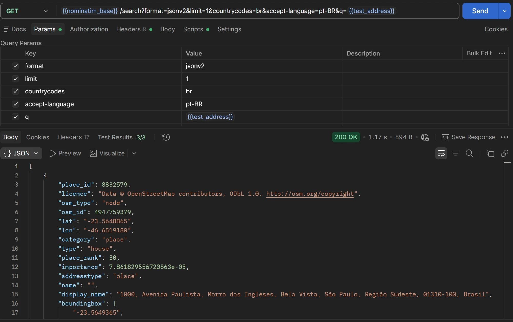
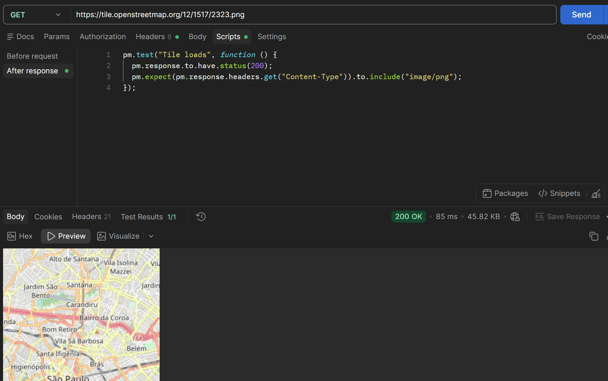
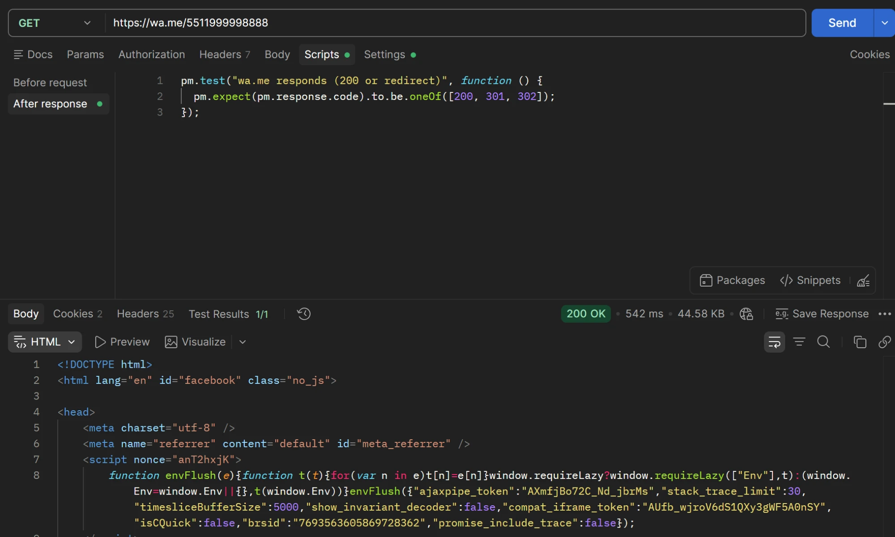
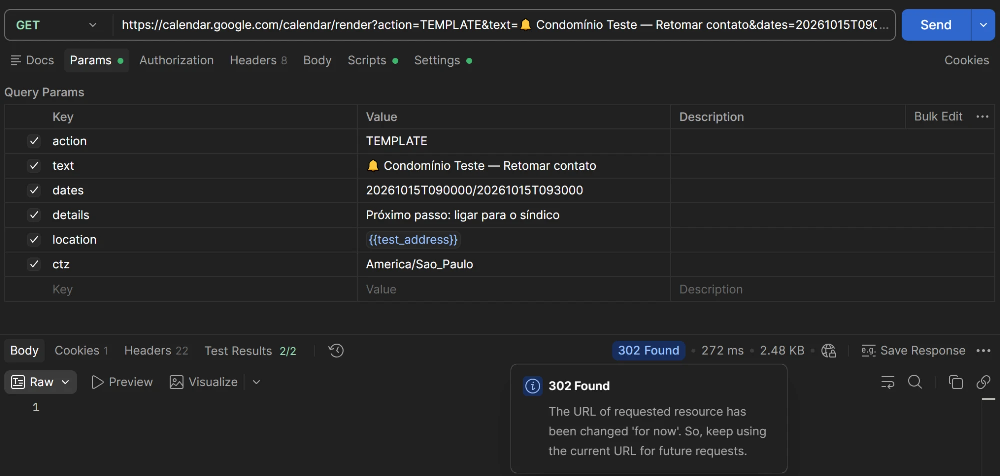

# Integration tests (Postman)

Manual API tests for the three external integrations used by KMD3 Market:
OpenStreetMap, WhatsApp and Google Calendar.

- **Tool:** Postman (desktop app)
- **Collection:** `kmd3 market integrations`
- **Environment:** `KMD3Market`
- **Date run:** 2026-10-06

## How each integration works in the app

| Integration | Code | What it does | What Postman can verify |
|---|---|---|---|
| OpenStreetMap | `mapa.js` (`nominatim()`, tile layer) | Geocodes addresses with the Nominatim API and loads map tiles | The real API calls |
| WhatsApp | `app.js` (`whatsappLink()`) | Builds a `https://wa.me/<number>` link; no API or key | That the link target responds |
| Google Calendar | `app.js` (`linkGoogleAgenda()`) | Builds a `calendar.google.com/calendar/render?action=TEMPLATE…` link; no API or key | That Google accepts the link |

WhatsApp and Google Calendar are plain links, so these tests confirm the
endpoints respond. They cannot confirm that a message was sent or an event was
created, which needs a browser session.

## Environment variables

| Variable | Value |
|---|---|
| `nominatim_base` | `https://nominatim.openstreetmap.org` |
| `test_address` | `Avenida Paulista 1000, São Paulo` |
| `test_phone` | `(11) 99999-8888` |

## Results

| # | Integration | Request | Assertions | Result |
|---|---|---|---|---|
| 1 | OpenStreetMap | `GET {{nominatim_base}}/search` (Geocode address) | Status 200; at least one result; coordinates inside Brazil | 200 OK, 3/3 passed |
| 2 | OpenStreetMap | `GET tile.openstreetmap.org/12/1517/2323.png` (Map tile) | Status 200; `Content-Type` is `image/png` | 200 OK, 1/1 passed |
| 3 | WhatsApp | `GET https://wa.me/5511999998888` | Responds with 200, 301 or 302 | 200 OK, 1/1 passed |
| 4 | Google Calendar | `GET calendar.google.com/calendar/render?action=TEMPLATE…` | Google accepts the link; `dates` format is valid | 302 Found, 2/2 passed |

### 1. OpenStreetMap: geocoding

`Avenida Paulista 1000, São Paulo` resolves to lat `-23.5648865`, lon
`-46.6519180`, which is the right place.

### 2. OpenStreetMap: map tile

The tile for zoom 12 over São Paulo loads as a PNG.

### 3. WhatsApp link

`wa.me` answers for a number in the format `whatsappLink()` produces
(`55` + DDD + number).

### 4. Google Calendar link

Google answers the event-template URL with a 302 redirect. Postman is not signed
in, so it is sent to the login page. That is the expected response.

## Not yet covered

- `Geocode - not found` (nonsense address returns an empty list): not captured.
- Phone-number logic checks for `whatsappLink()` (adds `55`, rejects short numbers): not captured.
- Full Collection Runner report: the first run failed with "Empty request URL"
  because the requests were unsaved. A rerun after saving is still to be added.
- The `.ics` export runs in the browser and cannot be tested in Postman.

## Notes

- Nominatim allows at most 1 request per second. Use a Runner delay of 1100 ms
  or more, and send a descriptive `User-Agent` header.
- Do not commit exported Postman files that contain credentials. The collection
  authorization is set to **No Auth**.
